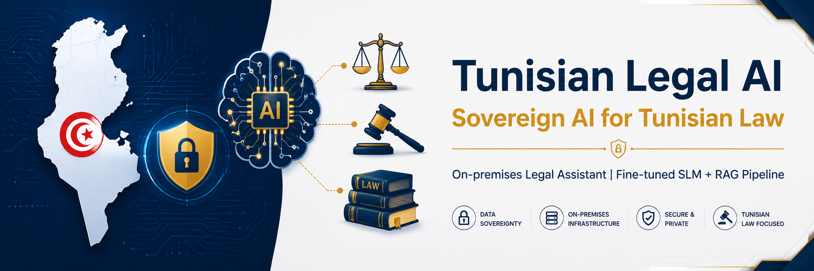
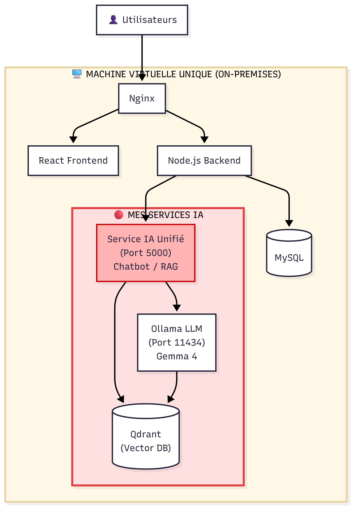
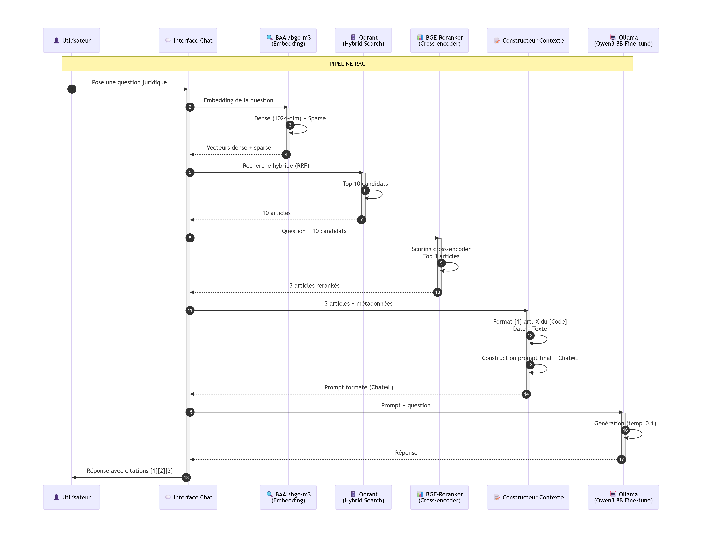

# 🇹🇳 Tunisian Legal AI — Data Sovereignty in Legal AI



> _"A Tunisian legal assistant, hosted in Tunisia, for Tunisians."_

---

## 🎯 The Project

This project aims to **migrate E-Tafakna's legal AI infrastructure** from the cloud to a **sovereign on-premises solution**. The goal is to ensure the confidentiality of Tunisian legal data while providing a reliable, source-grounded conversational assistant.

| Challenge                             | Solution                                     |
| ------------------------------------- | -------------------------------------------- |
| ❌ Generic models unfit for local law | ✅ Fine-tuned on Tunisian legal corpus       |
| ❌ Flawed classic RAG pipeline        | ✅ Hybrid RAG pipeline (RRF + Cross-encoder) |
| ❌ External cloud dependency          | ✅ 100% on-premises deployment               |

---

## 🏗️ Global Architecture



_All services are hosted on a single virtual machine (VM)._

---

## 🔬 Two Technical Pillars

### 1. SLM Fine-tuning

- **Final Model**: Gemma 4 E4B (4B effective parameters)
- **Method**: QLoRA (4-bit quantization) with Unsloth
- **Dataset**: 1,660 examples from JORT
- **Final Loss**: 0.1075

### 2. Hybrid RAG Pipeline

| Step          | Technology                       |
| ------------- | -------------------------------- |
| 1️⃣ Embedding  | BAAI/bge-m3 (Dense + Sparse)     |
| 2️⃣ Search     | Qdrant (Hybrid)                  |
| 3️⃣ Fusion     | RRF (Reciprocal Rank Fusion)     |
| 4️⃣ Reranking  | Cross-encoder bge-reranker-v2-m3 |
| 5️⃣ Generation | Ollama (Gemma 4 FT)              |



---

## 📊 Key Results

| Metric                           | Value               |
| -------------------------------- | ------------------- |
| Retrieval Precision              | **100%** (8/8)      |
| Out-of-scope Refusal Rate        | **80%**             |
| Hallucinations (Lawyer Verified) | **0%** (10 samples) |
| Average Latency                  | **2.8 seconds**     |
| Cost per Query                   | **0 TND**           |

---

## 🗂️ Repository Structure

Complete-tunsian-law-RAG-Pipeline/
├── 1_Dataset_Collection_For_FT/ # JORT dataset construction
│ ├── README.md
│ └── ...
├── 2_RAG_Pipeline/ # Complete RAG Pipeline
│ ├── README.md
│ └── ...
└── README.md # This file

---

## 🚀 Getting Started

```bash
# Clone the repository
git clone https://github.com/Hedi-Bk/Complete-tunsian-law-RAG-Pipeline.git
cd Complete-tunsian-law-RAG-Pipeline

# Check each subfolder's README
cd 1_Dataset_Collection_For_FT
# Follow instructions...

```

## **📝 Author**

**Hedi Ben Khalifa** — SUP'COM Tunis, Final Year Project (PFE) 2026

---

## **📄 License**

This project is licensed under **Apache 2.0**.
